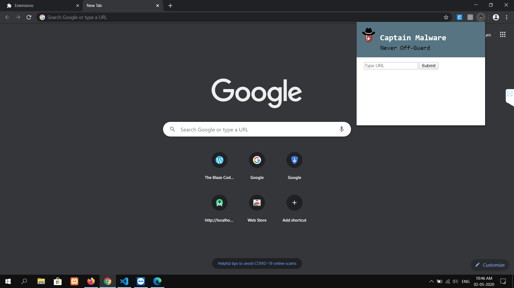
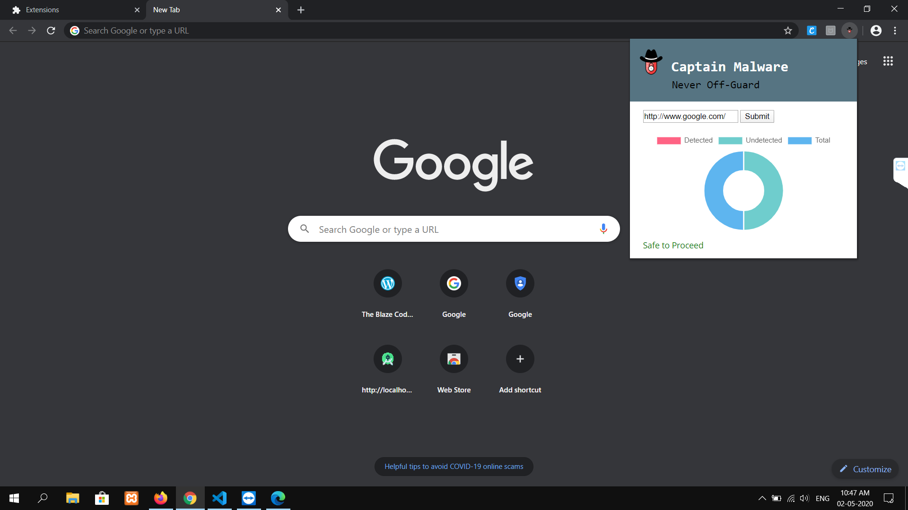
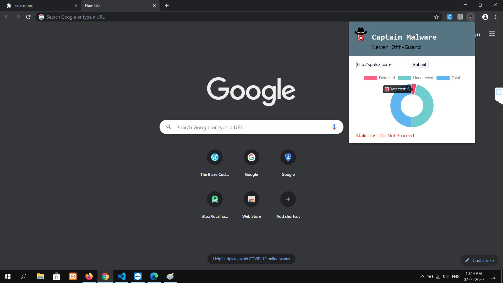

# This is the HackoVIT hackathon Repository

We are implementing the chrome Extension to detect the malacious websites

***

### Instructions to use

* clone the repository
* Open google chrome => settings => Extensions
* Turn on the Developer Mode
* Load Unpacked
* Select the cloned repo on your system
* Click on the reload Button
* Now the icon is on the right side of the address bar
* Extension is Ready to Go!

### Important
Format of the URL should be http(s)://www.abc.xyz.com/

### screenshots

